# Changelog

Todos los cambios notables del sitio de **Tuterritorio — Catastro Multipropósito de Valledupar** se documentan en este archivo.

El formato se basa en [Keep a Changelog](https://keepachangelog.com/es-ES/1.0.0/) y el proyecto sigue [Versionado Semántico](https://semver.org/lang/es/): **PARCHE** = correcciones y ajustes finos · **MENOR** = secciones o funcionalidades nuevas · **MAYOR** = rediseños que transforman el sitio. Desde la v2.5.0 la versión vigente se muestra en la esquina inferior derecha de la tarjeta del footer.

## [Unreleased]

## [2.8.5] - 2026-07-23

### Cambiado
- Encuadre de la foto de las banderas del Inicio ajustado a center 30%.

## [2.8.4] - 2026-07-23

### Cambiado
- Encuadre de la foto de las banderas del Inicio ajustado a center 36% (se ve más cielo y las banderas completas).

## [2.8.3] - 2026-07-23

### Cambiado
- Nueva fotografía de la franja de cierre del Inicio: las banderas de los corregimientos al atardecer, encuadrada al centro de las astas. Optimizada de 6,3MB a 117KB en escritorio y 40KB en móvil (WebP, nombre nuevo foto-banderas2 para saltar la caché); las versiones anteriores se eliminaron.

## [2.8.2] - 2026-07-23

### Corregido
- El arreglo del scroll (v2.8.1) no funcionaba en producción: el componente dependía del remontaje del template, que en producción no ocurre. Ahora reacciona directamente al cambio de ruta (usePathname), así que al entrar a cualquier sección de Transparencia (1–10) —o a cualquier otra página— la vista siempre arranca desde el principio, también en producción.

## [2.8.1] - 2026-07-23

### Corregido
- Toda navegación por clic o tap (por ejemplo, las tarjetas 1–10 de Transparencia) ahora arranca al principio de la página destino, sin importar dónde estaba el scroll. Se respetan las excepciones correctas: los enlaces con ancla (#sección) van a su ancla y el botón atrás del navegador sigue restaurando la posición anterior.

## [2.8.0] - 2026-07-23

### Añadido
- Heros fotográficos con sitios emblemáticos de Valledupar en las 9 subsecciones de Transparencia, cada uno encuadrado en lo más destacado de la foto: 1 Información de la entidad (Vaso Coyabro), 2 Normativa (La Sirena), 3 Contratación (Parque El Viajero), 4 Planeación (Plaza Alfonso López), 5 Trámites (mural de Escalona), 7 Datos abiertos (busto del cantante), 8 Grupos de interés (letras de Valledupar), 9 Reporte de información (Cacique Upar) y 10 Protección de datos (Hernando de Santana). Las 9 fotos se optimizaron de ~106MB a ~1,7MB (WebP escritorio + variante móvil) con precarga del hero para mantener el rendimiento.

### Eliminado
- Limpieza de la carpeta de assets: 94 archivos huérfanos (15,2MB) que ya no usa ninguna página — versiones JPG reemplazadas por WebP, fotos y logos de pruebas anteriores y duplicados.

## [2.7.20] - 2026-07-23

### Cambiado
- Pasada completa de responsive móvil: se auditaron las 17 páginas a 390px y 360px (cero desbordamientos horizontales en todas). Las etapas del proceso catastral en Nosotros ahora son compactas en celular (cuadrado de máx. 210px centrado, textos y espacios ajustados) en vez de ocupar casi una pantalla por etapa, y en modo oscuro los cuadrados llevan un contorno sutil para que el navy no se funda con el fondo.

## [2.7.19] - 2026-07-23

### Añadido
- Las cifras del Inicio (+4.340 trámites, 83% efectividad, 6 + 25 sectores) ahora cuentan desde 0 hasta su valor cuando la sección entra en pantalla, con separador de miles y frenado suave al final. Sin JavaScript o con movimiento reducido se muestran fijas.

## [2.7.18] - 2026-07-23

### Corregido
- El LCP móvil baja notablemente: la animación de entrada arrancaba TODA la página en opacidad 0, así que el navegador no contaba el hero como pintado hasta ~0,5s después. Ahora el fade lo hace cada sección y el hero fotográfico solo se desliza (su imagen pinta de inmediato); la animación se ve igual. Además el hero móvil del Inicio se recomprimió (foto-panoramica-m2.webp, 780px, 35KB, −19%). Medido en local con 4G lenta: LCP ~0,5s.

## [2.7.17] - 2026-07-23

### Cambiado
- Rendimiento en computador: las fotos de TODO el sitio (heros, bandas e imágenes de contenido, 58 archivos) pasan a WebP donde el formato gana; 11 fotos que ya estaban mejor comprimidas en JPG se conservan tal cual. Verificado que las 90 referencias del código apuntan a archivos existentes y que las 10 páginas principales cargan su hero sin errores.

## [2.7.16] - 2026-07-23

### Cambiado
- Mejoras de rendimiento móvil (PageSpeed): el CSS ahora va incrustado en el HTML (elimina la solicitud que bloqueaba el primer renderizado ~300 ms), las fotos del Inicio pasan a WebP (hero, archivo y banda de banderas: hasta 43% más livianas), la caché de /assets y /docs sube a 1 año inmutable (regla: renombrar el archivo al reemplazarlo) y el JavaScript deja de incluir polyfills para navegadores antiguos (browserslist moderno).

## [2.7.15] - 2026-07-23

### Añadido
- Los buscadores funcionan por completo en la versión en inglés: el buscador del sitio muestra su interfaz en inglés (placeholder, botón y mensaje de "sin resultados") y etiqueta en inglés las categorías del contenido dinámico (Noticias, Normativas, Glosario y Equipo); el buscador de trámites entiende términos en inglés ("owner", "subdivision", "appraisal", "free", "certificate"…) gracias a un índice bilingüe por trámite, y su interfaz y conteos también se muestran en inglés.

## [2.7.14] - 2026-07-23

### Corregido
- En la versión en inglés ya no se pegan las palabras a los términos protegidos ("ofTuterritorio", "theTuterritorio", "filePQRSD"): los espacios vecinos se conservan dentro de las cápsulas que Google Translate no traduce.
- El elemento "Participa" del menú ahora se muestra como "Participate" en la versión en inglés (Google lo trataba como nombre propio y no lo traducía).

## [2.7.13] - 2026-07-23

### Corregido
- Los portátiles pequeños (1081–1360px, incluidos los de 1366px con escala de Windows al 125%) ya no ven el menú de celular: el menú de escritorio se compacta (enlaces, logos y buscador reducidos) y la hamburguesa queda solo para tablets y celulares (≤1080px).

## [2.7.8 – 2.7.11] - 2026-07-22

### Cambiado
- La foto del hero de Normativas quedó con un desenfoque suave y uniforme en toda la imagen: se distinguen las resoluciones pero el texto legal es ilegible (se probaron variantes de desenfoque total fuerte y selectivo bajo "CONSIDERANDO" antes de la versión final; el archivo quedó en 65KB).

## [2.7.7] - 2026-07-22

### Cambiado
- Nueva fotografía del hero de Normativas (resoluciones del Municipio), optimizada de 2.2MB PNG a 160KB JPG + variante móvil de 47KB.

## [2.7.6] - 2026-07-22

### Añadido
- Foto y datos de la Gerente, Lulia Cristina Maestre Arcia, en la sección "Quienes orientan nuestra gestión" de Nuestro Equipo.

## [2.7.5] - 2026-07-22

### Eliminado
- El rótulo "Accesos rápidos" y la línea multicolor junto al título "Enlaces de interés" del Inicio.

## [2.7.4-produccion] - 2026-07-22

### Publicado
- 🚀 **El rediseño completo (v2.0.0 → v2.7.4) se fusionó a `main` y quedó publicado en producción** en https://www.tuterritorio.gov.co (69 commits, 163 archivos).

## [2.7.4] - 2026-07-22

### Añadido
- Variantes móviles (`-m.jpg`, 860px, 25–86KB) para las 14 fotos de las franjas de cierre, la ortofoto del visor y las 5 fotos de contenido (vía `srcSet`). En celular ya ninguna imagen descarga la versión de escritorio: Nosotros pasó de ~700KB de fotos a **149KB**.

### Cambiado
- El CTA "¿No encontraste tu respuesta?" del explorador de FAQ adopta el estilo del sitio: tarjeta navy con botones pill corporativos.

## [2.7.3] - 2026-07-22

### Cambiado
- Encuadre más abierto del hero de Radica tu PQRSD (`center 15%`).

## [2.7.2] - 2026-07-22

### Corregido
- Franja blanca que podía aparecer entre la foto de cierre y el footer (se retiró `content-visibility` de la franja).

## [2.7.1] - 2026-07-22

### Cambiado
- Espacio entre los cuadrados redondeados del diagrama de etapas (ya no se solapan).

## [2.7.0] - 2026-07-22

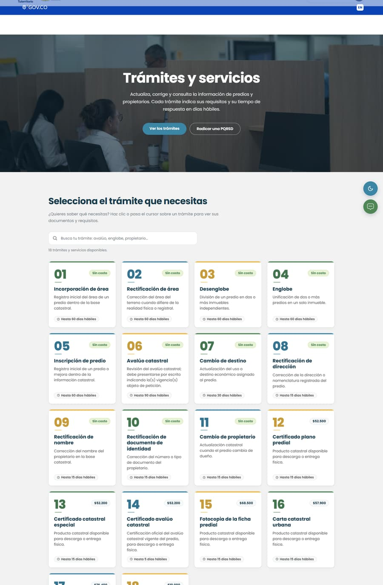

### Añadido
- **Buscador de trámites**: filtro en vivo sobre las 18 tarjetas de Servicios (por nombre, descripción, documentos y costo, sin tildes) con contador de coincidencias y mensaje guía para hacer clic en cada trámite.
- **Buscador del sitio ampliado**: el índice pasa de 11 a 27 entradas (ES/EN) cubriendo las 10 subsecciones de Transparencia, Participa, FAQ, carta de trato digno, mapa del sitio, accesibilidad y legales.
- Variantes móviles (860px, 16–97KB) para las 17 fotos de hero; precarga del hero con media queries en 18 páginas; caché de 1 día + SWR de 7 días para `/assets` y `/docs`.

### Cambiado
- Lighthouse móvil simulado: **78 → 89** (LCP 6.0s → 3.5s). Fotos pesadas recomprimidas hasta −40%.
- En celular la tarjeta del footer ya no se monta sobre el contenido (margen positivo ≤900px).

### Eliminado
- Botón "Consulta tu predio" del hero del Inicio.

## [2.6.x] - 2026-07-22

Serie de trece parches y mejoras menores del mismo día:

### Añadido
- **Barra superior GOV.CO según lineamientos** (2.6.0): 56px, azul Cobalt #0943B5, logo SVG oficial de 136×24 enlazando a gov.co/home, área táctil de 44px, y el **cambio de idioma ES/EN como chip en la barra** (se eliminó el círculo flotante).
- **Carta de trato digno en PDF** publicada en `/docs` y enlazada con botón (2.6.3).
- Fotos `foto-dudas` y `foto-digno` en Atención a la ciudadanía (2.6.2); `foto-catastro` en "El operador" y `foto-equipo` en el hero de Nuestro Equipo (2.6.9, 2.6.13) — con esto se cerraron **todas** las imágenes pendientes del sitio.
- Fotos propias en los heros de las páginas legales: sombreros vueltiaos, callejón de banderines, monumento y la iglesia (2.6.11).
- Versión del sitio visible en el footer con la convención semántica documentada.

### Cambiado
- **Etapas del Proceso Catastral como diagrama de fases** (2.6.7): 4 formas de cuadrado redondeado (alusión al imagotipo) en colores corporativos con listas numeradas continuas, unificadas con su cabecera (2.6.13).
- Nosotros: fondos alternos por sección, Misión y Visión como banda navy oscura en modo claro, línea de tiempo de compromisos sin números, video sin caja de fondo, y "Lo que hacemos" con su composición Bento original (2.6.8–2.6.10).
- Contactos volvió al diseño ATG tras probar el original (2.6.4), con horario de jornada partida (2.6.5) y el obelisco completo en la franja (2.6.6).
- Botones pill: en modo oscuro cambian a azul claro #59A9C4 con texto navy, incluidos los de los heros (2.6.1).
- Menú móvil con cabecera navy sólida y foco de teclado blanco sobre la barra GOV.CO (2.6.12).
- Traductor: sin logo ni atribución de Google visibles, y "ensure Tuterritorio" conserva su espacio (2.6.10).

## [2.5.x] - 2026-07-22

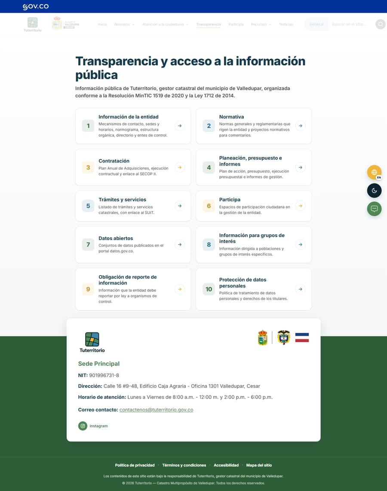
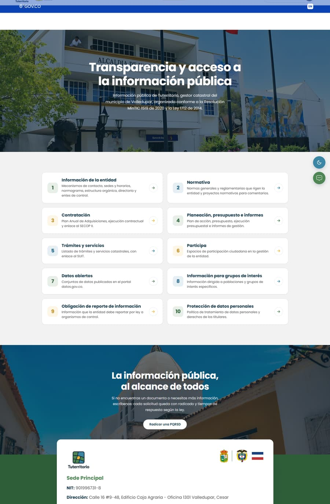

### Añadido
- Entrada escalonada del texto de los heros en **todas** las páginas y transición de página completa en cada navegación (`app/template.tsx`).
- Animación del "Tuterritorio" del Inicio: fade-in-left + shimmer degradado permanente sin salto de bucle, solo en el Inicio (2.5.1 y previas).

### Cambiado
- **Transparencia recuperó sus tarjetas originales** (número de color, acento y flecha) en 2 columnas anchas; hover del número en blanco también en las amarillas (2.5.3–2.5.4).
- Tarjetas de Participa 6.1–6.5 uniformes con modo oscuro (2.5.1); tarjetas de Atención con el diseño numerado y sin íconos (2.5.6); hero del Inicio más grande (2.5.2).

### Corregido
- Los elementos con animación de aparición desaparecían al navegar entre páginas y volver (RevealManager ahora se re-ejecuta por ruta) (2.5.5).
- El CSP bloqueaba `eval` en el servidor de desarrollo (solo dev; producción intacta) (2.5.6).

## [2.4.0] - 2026-07-21 — Pack de fotos de Valledupar

### Añadido
- **~25 fotografías propias** tomadas por el equipo: heros de las 7 páginas del menú (panorámica con la Sierra, oficina con el pendón, módulo SAT, socialización, parque), heros de submenús (trámites, canales, radicación, ventanillas, resoluciones, plano catastral) y **franjas de cierre por página** con los monumentos de Valledupar (guitarra, juglares, obelisco, poporos, pilonera, María Mulata, Plaza Alfonso López, iglesias, río Guatapurí).
- Franja fotográfica de cierre creada en las 6 páginas que no la tenían.

### Cambiado
- Fotos del artefacto reescaladas con IA (Real-ESRGAN 4×): el letrero "ALCALDÍA DE VALLEDUPAR" y demás detalles quedaron nítidos.
- Todas las fotos optimizadas con mozjpeg (de 3–43MB de cámara a 100–450KB) y encuadres (`background-position`) ajustados por sujeto.

## [2.2.0] - 2026-07-21 — Tipografía y estructura

### Cambiado
- Tipografía del sitio: **Poppins** (pasando brevemente por Outfit; el rediseño usó Sora), auto-hospedada con `next/font` y los mismos tamaños.
- Header: barra unificada ensanchada a 1560px, compactación entre 1361–1600px y menú hamburguesa desde 1360px — el buscador ya no se desborda y el menú queda centrado.
- Fotos del rediseño movidas de `/assets/atg/` a `/assets/`.
- Limpieza visual: fuera las barras tipo navegador (3 puntitos) de todas las imágenes, los subtítulos-eyebrow ("01 · Visor geográfico") y los chips del visor.

## [2.0.0] - 2026-07-17 — Rediseño completo (rama `staging-2`)

El sitio entero se rediseñó con una nueva estructura visual: heros fotográficos con tinte, bandas de contenido, tarjetas tipo ventana, cifras y franjas de cierre.

**Inicio — antes:**

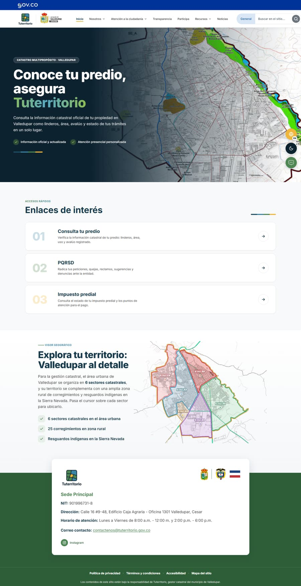

**Inicio — después:**

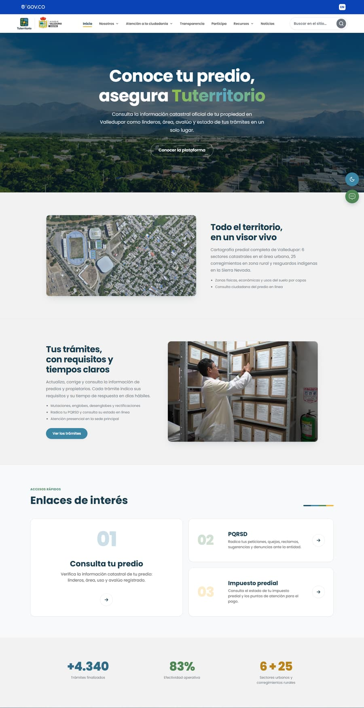

**Nosotros — antes:**

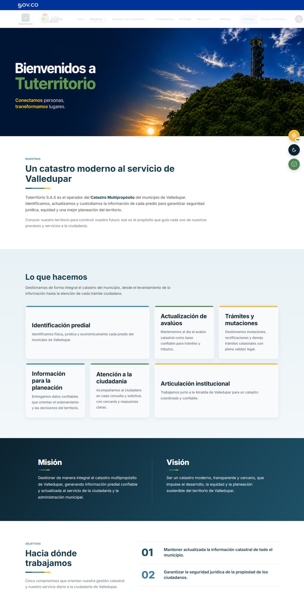

**Nosotros — después:**

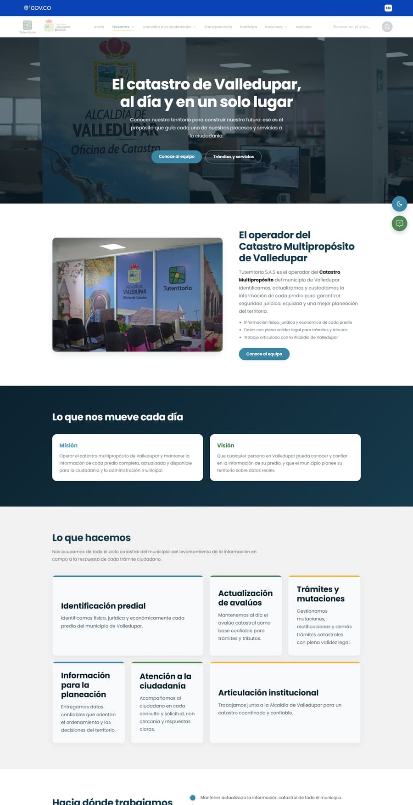

| Página | Antes | Después |
|---|---|---|
| Atención a la ciudadanía | 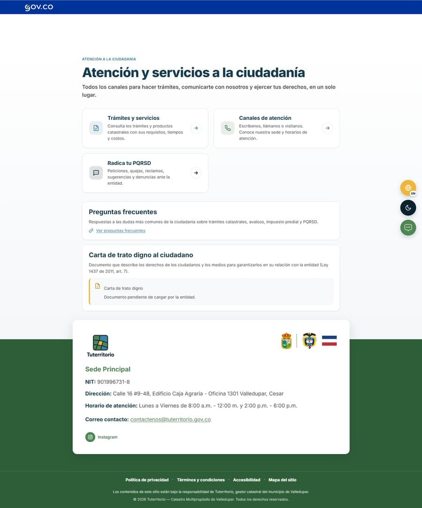 | 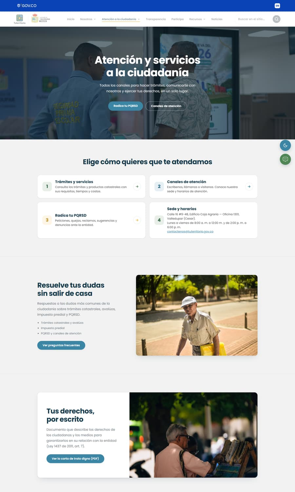 |
| Transparencia |  |  |
| Participa | 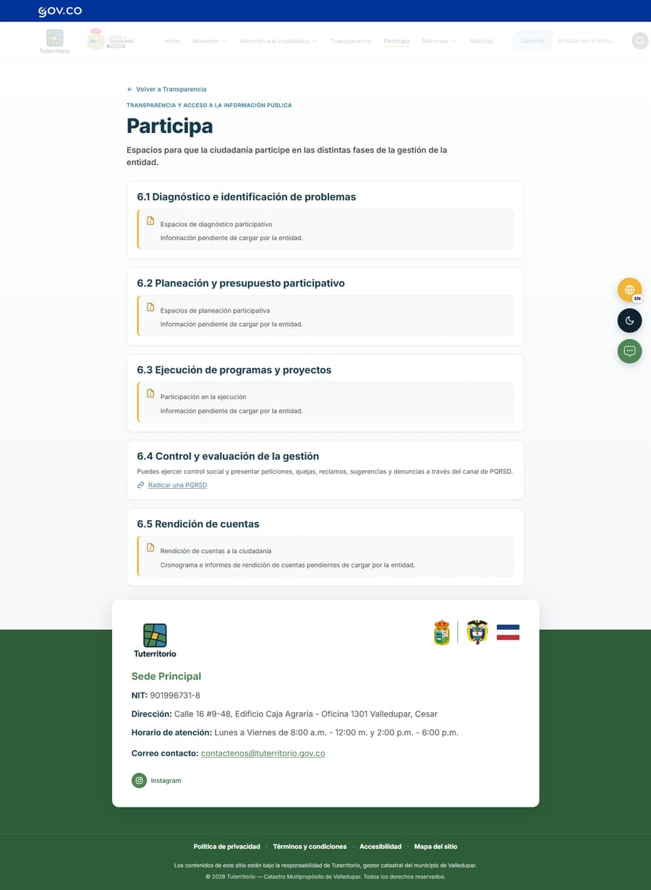 | 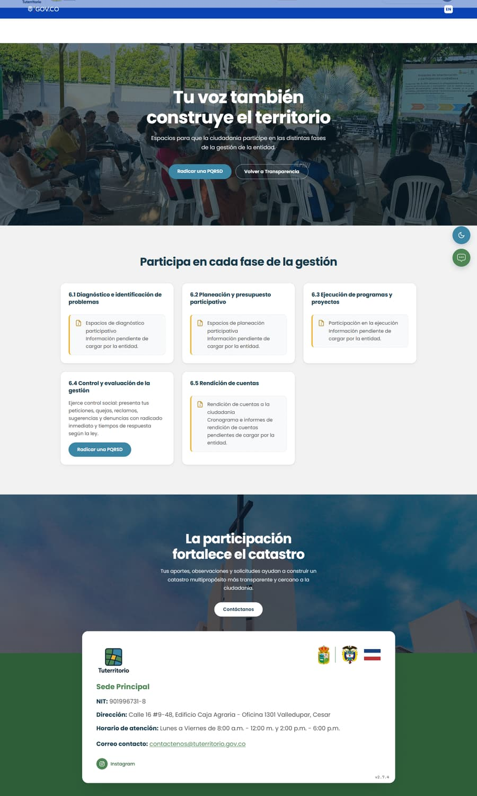 |
| Recursos (Normativas) | 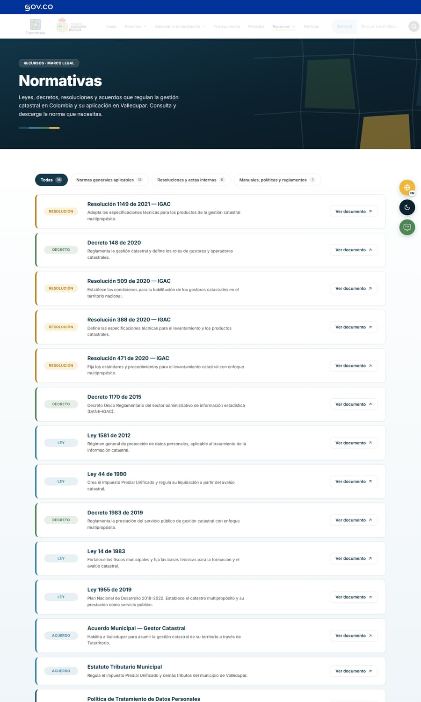 | 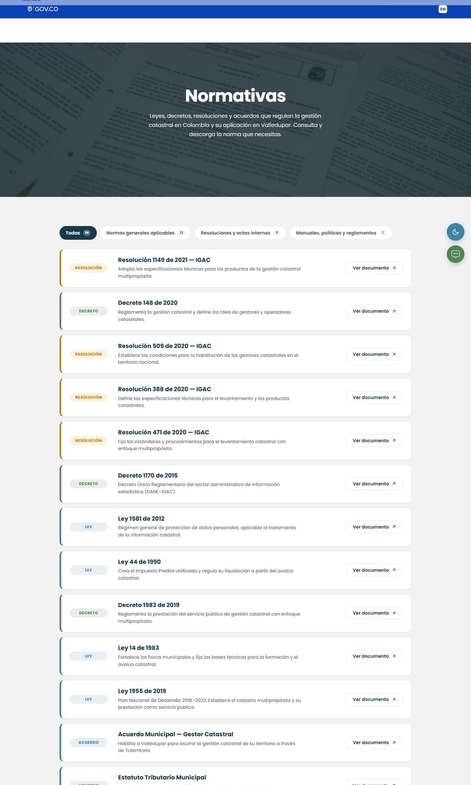 |
| Noticias | 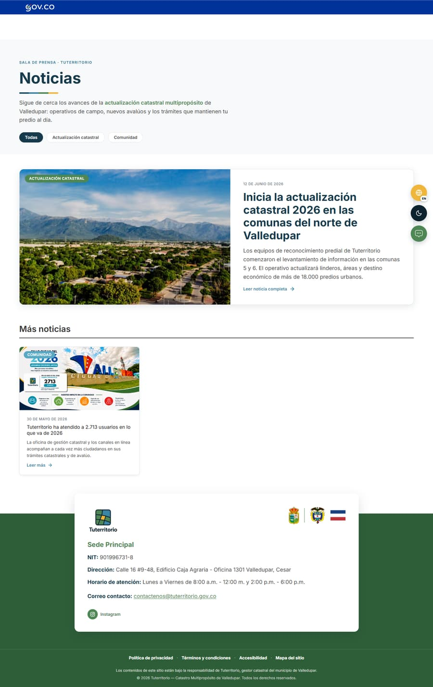 | 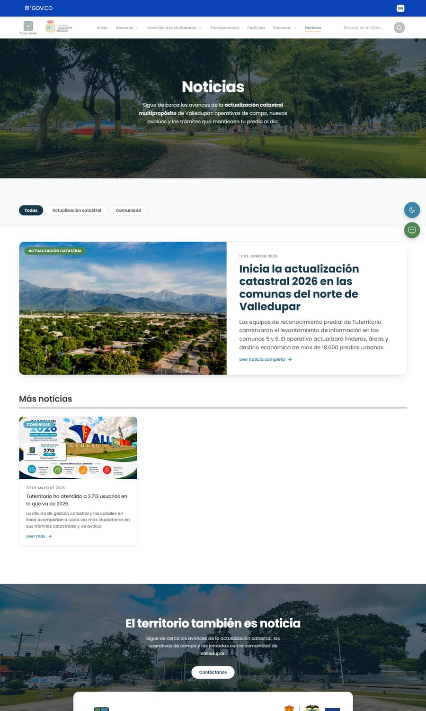 |
| Trámites y servicios | 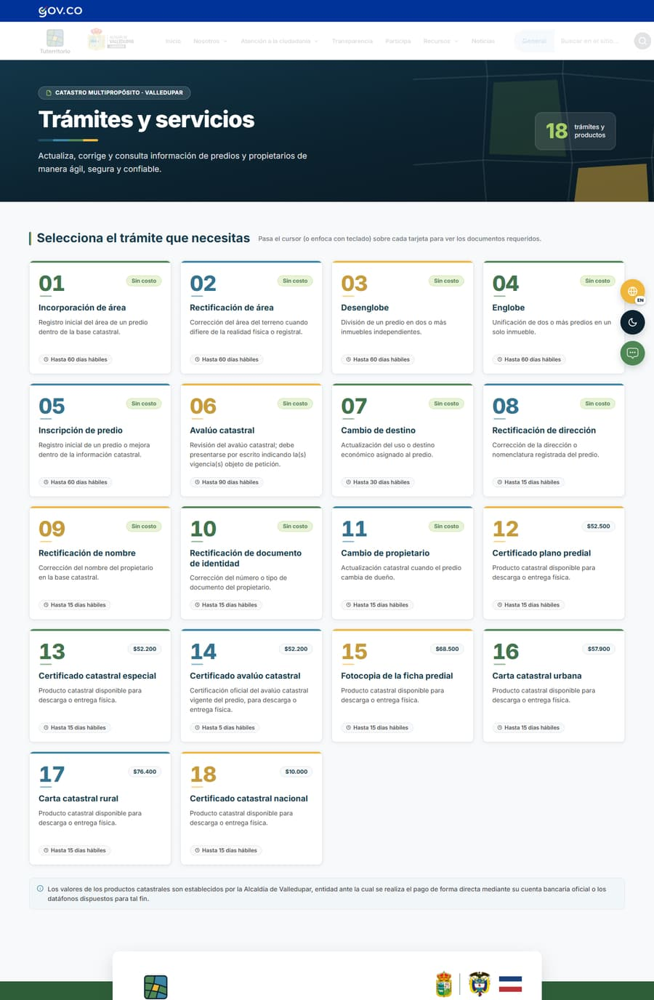 |  |

> La versión detallada de esta documentación, con cada versión individual y todas las capturas, está en el archivo Word `Documentacion-Versiones-Tuterritorio-2026-07-22.docx`.

### Añadido
- Nueva estructura en las 44 páginas: Inicio, Nosotros, Equipo, Atención, Transparencia (hub + 9 subpáginas), Participa, Recursos, Noticias, Servicios, PQRSD, Contactos, mapa del sitio y legales.

### Cambiado
- **Paleta corporativa de Tuterritorio** aplicada sobre la nueva estructura (navy #0C222F, azul #3B85A5, verde #4E8654, lima #8FBE4E, ámbar #F0B63B) — se descartaron los colores del diseño de referencia.
- Se conservaron el **footer verde original** con su tarjeta blanca y los **Enlaces de interés** originales del Inicio (decisión del equipo: no mezclar la información del sitio con la de la referencia).

## [1.5.0] - 2026-07-17 — Rendimiento y SEO (producción)

### Corregido
- Rendimiento móvil: PageSpeed **74 → 98** (LCP 7.7s → 2.3s) difiriendo los ~100KB de Google Translate (solo cargan con la cookie EN); escritorio 94 → **100**.
- Indexación en Google: el sitemap, los canonicals y robots declaraban el host sin `www` (que redirige) — se corrigieron las tres fuentes; video institucional marcado `noindex`.
- Accesibilidad: foco en elementos `aria-hidden` (atributo `inert`) y contrastes.

### Añadido
- Documento Word con la documentación de tests y auditorías (móvil y escritorio, con capturas).
- Link oficial de Instagram en el footer.

## [1.1.0] - 2026-06-27

### Añadido
- ABC Catastral como acordeón expandible con 17 términos nuevos.
- Correo de contacto con diseño corporativo.

### Cambiado
- "Nuestras funciones" en layout Bento asimétrico; panel de documentos de trámites adaptado a claro/oscuro; ribbons y barra de scroll con la paleta corporativa.

## [1.0.0] - 2026-06-21 — Lanzamiento

### Añadido
- Sitio inicial de Tuterritorio: landing con panel de administración de contenido, modo oscuro, buscador, traductor ES/EN, formularios de PQRSD y contacto, y despliegue en Vercel bajo `tuterritorio.gov.co`.
